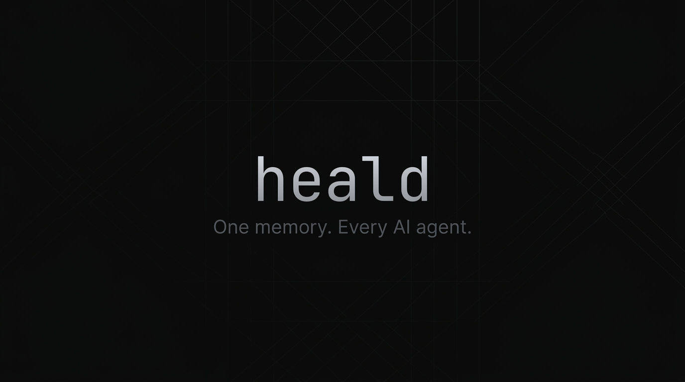
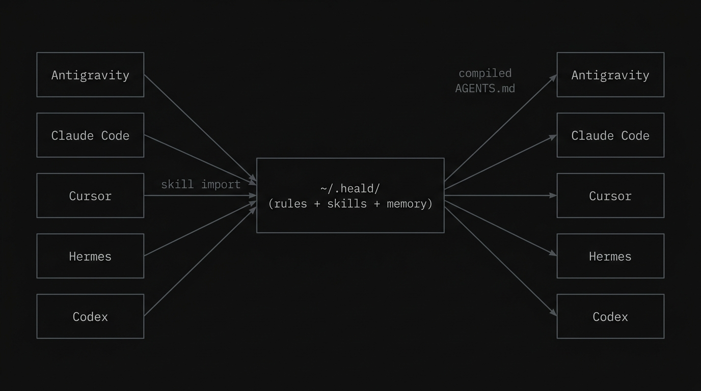

<p align="center">
  
</p>

<p align="center">
  <strong>One memory. Every AI agent.</strong><br>
  A single-binary CLI that keeps Antigravity, Claude Code, Cursor, Hermes, and Codex all reading from the same rules and project memory — automatically.
</p>

<p align="center">
  
  
  
  
</p>

---

## The Problem

You work across multiple AI coding agents. You make a decision in Antigravity, switch to Claude Code, and it has no idea what you just decided. So you re-explain. Then Cursor needs the same thing. You re-explain again.

Even within the same agent, every new chat starts from zero. The agent has no memory of your stack choices, architectural decisions, or project conventions.

Three problems compound each other:

1. **No context on switch** — switching harnesses loses everything. You re-explain architecture, decisions, and conventions from scratch.
2. **Context rot** — tools that *do* persist memory tend to accumulate everything forever. Bloated memory degrades agent output instead of improving it.
3. **No single source of rules** — each harness wants its own format (`CLAUDE.md`, `.cursor/rules`, `AGENTS.md`, etc.). Skills you write in one agent never reach another.

---

## The Solution

<p align="center">
  
</p>

Heald is a single Rust binary. You install it once. It acts as the shared brain between all your AI agents:

- **One `heald init`** scaffolds the local project store and injects Heald's instructions into the global config of every AI agent on your machine.
- **Skills you have** in any agent (Antigravity, Cursor, Hermes) are automatically imported into `~/.heald/skills/` on init.
- **Every compiled `AGENTS.md`** gets a live routing table pointing at those global skills by absolute path — so any agent, in any project, can load any skill without local copies.
- **`heald remember`** saves decisions into the project's memory store as plain Markdown. Any agent in any harness can read them back with `heald context`.
- **Budget-aware pruning** means the agent gets the *right* subset of memory for its context window, not a dump of everything.

---

## What Heald is NOT

| ❌ Not this | ✅ But this |
|---|---|
| A vector database | Plain Markdown + YAML, readable without Heald |
| A cloud service | Local-first, git-friendly, purely file-based |
| An MCP server | A single binary. Run it, it exits. No process to keep alive. |
| A Node/Python script | Zero runtime dependencies. Just Rust. |
| An "remember everything" dumper | Budget-aware pruning: scores by pin status, recency, and frequency |

---

## How It Compares

| Tool | Runtime | Memory | Skills sync | Auto-routing table | Budget pruning |
|---|---|---|---|---|---|
| **Heald** | Single Rust binary | ✅ Plain Markdown | ✅ Auto-imported from all agents | ✅ Dynamic, from actual skills | ✅ |
| Memorix / memsearch | Node / Python MCP server | ✅ | ❌ | ❌ | ❌ |
| ai-memory | Node + web UI | ✅ LLM-written | ❌ | ❌ | ❌ |
| agentic-stack | Node + dashboard | ✅ | Partial | ❌ | ❌ |

Heald is the only tool here that: (1) requires zero runtime to keep alive, (2) auto-imports your existing skills from every agent on init, (3) generates a live routing table from those skills, and (4) prunes memory to your token budget.

---

## Installation

### From crates.io (recommended)

```bash
cargo install heald
```

> Requires [Rust](https://rustup.rs/) (stable). The binary lands in `~/.cargo/bin/heald` and is immediately available in your path.

### From source

```bash
git clone https://github.com/Parth3930/heald
cd heald
cargo install --path .
```

---

## Quick Start

### Step 1 — Initialize in your project

```bash
cd my-project
heald init
```

This does five things in one command:
- Creates `.heald/` (local memory, rules, skills store)
- Creates `~/.heald/` (global rules and skills — shared across all projects)
- Scans your existing agent skill directories (Antigravity, Cursor, Hermes, etc.) and imports them into `~/.heald/skills/`
- Compiles `AGENTS.md` in your project root with a live routing table pointing to those global skills
- Injects Heald's critical instructions into every global agent config file on your machine (`~/.gemini/config/AGENTS.md`, `~/.claude.md`, `~/.cursor/rules/heald.mdc`, `~/.hermes/AGENTS.md`)

**Output:**
```
Initialized Heald locally at /my-project/.heald
Initialized Heald globally at ~/.heald
Imported skill 'theme' into global Heald store.
Imported skill 'backend-principles' into global Heald store.
Compiled to ~/.heald/AGENTS.md
Compiled to AGENTS.md
Appended Heald hook to ~/.gemini/config/AGENTS.md
Appended Heald hook to ~/.claude.md
Appended Heald hook to ~/.cursor/rules/heald.mdc
```

### Step 2 — Let agents work normally

Once initialized, **every AI agent that reads your global config will automatically**:

1. Run `heald context agents` at the start of every task → loads project memory
2. Run `heald remember ...` when they make architectural decisions → saves to memory  
3. Run `heald finalize --summary "..."` at the end → logs the session

You do not need to prompt them to do this. It is embedded in their global rules.

### Step 3 — Add project rules

Create any `.md` file in `.heald/rules/` with OKF frontmatter:

```markdown
---
type: rule
title: "Database"
---
Always use PostgreSQL. Never SQLite in production.
```

Then sync to regenerate `AGENTS.md`:

```bash
heald sync
```

All agents immediately pick up the rule on their next task — no copy-paste, no manual updates.

### Step 4 — Log a decision

When an agent (or you) makes an important architectural call:

```bash
heald remember --type decision \
  --title "Chose PostgreSQL over MongoDB" \
  --body "We need ACID guarantees for financial transactions."
```

This creates `.heald/memory/chose-postgresql-over-mongodb.md` — a plain Markdown file, Git-diffable, readable without Heald.

### Step 5 — Switch agents without losing context

You finish a session in Antigravity. You open Claude Code on the same project.

Claude Code sees the Heald hook in `~/.claude.md`, runs `heald context agents`, and instantly knows:
- Every architectural decision made in the previous session
- All project rules (database, style, conventions)
- Which skills are available for what tasks (via the routing table)

**Zero re-explanation. Zero context lost.**

### Step 6 — Close out a session

```bash
heald finalize --summary "Added auth module, chose JWT over sessions for statelessness"
```

The summary is appended to `.heald/memory/log.md`. The next agent picks it up.

---

## CLI Reference

| Command | What it does |
|---|---|
| `heald init` | Initialize local + global store, import skills from all agents, inject hooks |
| `heald sync` | Recompile `AGENTS.md` from current rules + skills (run after editing rules) |
| `heald context agents` | Print budget-pruned memory context for the current project |
| `heald context agents --budget 4000` | Same, with a custom token budget (default: 8000 tokens) |
| `heald remember --type decision --title "..." --body "..."` | Save a memory document |
| `heald finalize --summary "..."` | Append session summary to the log |
| `heald doctor` | Validate all OKF files, report malformed frontmatter |

---

## File Structure

```
~/.heald/                        ← Global (shared across all projects)
├── rules/                       ← Universal rules (always included in every AGENTS.md)
├── skills/                      ← Imported skills from all agents (theme.md, backend.md, etc.)
└── AGENTS.md                    ← Canonical universal reference — what every global agent hook points at

my-project/
├── AGENTS.md                    ← Compiled project context (rules + skill routing table + memory hooks)
└── .heald/
    ├── rules/                   ← Project-specific rules
    ├── skills/                  ← Project-specific skills (usually empty; uses global)
    └── memory/
        ├── index.md             ← Always-included memory summary (pinned)
        ├── log.md               ← Session finalization log
        └── *.md                 ← Individual memory documents (decisions, context, etc.)
```

---

## Per-Agent Integration Guide

Heald's `init` command handles all of this automatically. This section is for reference or manual setup.

### Antigravity (agy)
**Global config:** `~/.gemini/config/AGENTS.md`  
Heald appends its CRITICAL INSTRUCTIONS block. Antigravity reads this on every session start.

### Claude Code
**Global config:** `~/.claude.md`  
Heald appends instructions. Claude Code reads `~/.claude.md` at the start of every conversation.

### Cursor
**Global config:** `~/.cursor/rules/heald.mdc`  
Heald creates this file. Cursor loads all `.mdc` files in `~/.cursor/rules/` globally.

### Hermes
**Global config:** `~/.hermes/AGENTS.md`  
Heald appends instructions. Hermes picks it up automatically.

### Codex
**Global config:** `~/.agents/AGENTS.md`  
Heald appends instructions to the global `.agents` format config.

### Any other agent
Point it at `~/.heald/AGENTS.md`. This is the canonical universal reference file that contains your rules, the routing table for all skills, and the memory instructions. Any agent that can read a Markdown file can use Heald.

---

## OKF — The Storage Format

Heald uses the **Open Knowledge Format (OKF)** — plain Markdown files with YAML frontmatter. No proprietary schema, no binary files, no database.

**Memory document:**
```markdown
---
type: decision
title: "Chose PostgreSQL"
timestamp: 2026-08-09T08:00:00Z
tags: [pinned]
---
We need ACID guarantees for financial transactions. MongoDB's eventual consistency
model was incompatible with our requirements.
```

**Rule file:**
```markdown
---
type: rule
title: "API Style"
---
All APIs must be RESTful. GraphQL only if the client needs field-level selection.
```

**Skill file:**
```markdown
---
type: skill
name: "backend-principles"
description: "Use for any backend/API work — building endpoints, auth, data access"
triggers: ["API", "endpoints", "auth", "backend logic"]
---
# Backend Principles
...
```

You can edit these files by hand, `git diff` them, review them in GitHub, or use them without Heald installed at all.

---

## Memory Budget & Pruning

Heald scores each memory document and drops the lowest-scored ones to fit within your token budget:

| Signal | Score |
|---|---|
| `tags: [pinned]` | +1000 |
| Each day since creation | −1 (max: −100) |
| `index.md` | Always included, never dropped |

```bash
# Get context for a 4000-token budget (roughly ~16KB of text)
heald context agents --budget 4000
```

The output header tells you exactly what was included and what was dropped:
```
<!-- Heald Context: Included 4/7 memory documents (Budget: 16000 chars) -->
```

---

## Known Limitations (v0.1)

- **No file locking:** Concurrent `heald sync` or `heald finalize` calls can race on shared files (`AGENTS.md`, `log.md`). Documented limitation — avoid running multiple agents simultaneously writing memory.
- **Silent skip on malformed files:** `heald context` skips broken OKF files rather than crashing the agent session. Use `heald doctor` to find them.
- **Codex:** Hook injection is not yet implemented for Codex-specific native format. The `.agents/AGENTS.md` fallback works.

---

## Contributing

Contributions are welcome. Please open an issue before starting significant work so we can align on direction.

**To contribute:**

1. Fork the repo
2. Create a branch: `git checkout -b feat/your-feature`
3. Make your changes with tests where applicable
4. Open a pull request with a clear description of what and why

**Areas that would benefit from contributions:**
- Codex native format compiler
- File locking for concurrent safety (`fs2` crate)
- `heald forget` command to remove specific memory documents
- Shell completions (bash, zsh, fish, PowerShell)
- Windows path normalization edge cases

---

## License

MIT License

Copyright (c) 2026 Parth Sharma

Permission is hereby granted, free of charge, to any person obtaining a copy of this software and associated documentation files (the "Software"), to deal in the Software without restriction, including without limitation the rights to use, copy, modify, merge, publish, distribute, sublicense, and/or sell copies of the Software, and to permit persons to whom the Software is furnished to do so, subject to the following conditions:

The above copyright notice and this permission notice shall be included in all copies or substantial portions of the Software.

THE SOFTWARE IS PROVIDED "AS IS", WITHOUT WARRANTY OF ANY KIND, EXPRESS OR IMPLIED, INCLUDING BUT NOT LIMITED TO THE WARRANTIES OF MERCHANTABILITY, FITNESS FOR A PARTICULAR PURPOSE AND NONINFRINGEMENT. IN NO EVENT SHALL THE AUTHORS OR COPYRIGHT HOLDERS BE LIABLE FOR ANY CLAIM, DAMAGES OR OTHER LIABILITY, WHETHER IN AN ACTION OF CONTRACT, TORT OR OTHERWISE, ARISING FROM, OUT OF OR IN CONNECTION WITH THE SOFTWARE OR THE USE OR OTHER DEALINGS IN THE SOFTWARE.

---

## Authors

| Name | Role |
|---|---|
| **Parth Sharma** | Creator & maintainer |

---

<p align="center">
  <em>Heald (n.) — a wire on a loom that threads through and guides each warp strand so every one stays aligned to the same pattern, controlled by the loom's harness. Same job here.</em>
</p>

